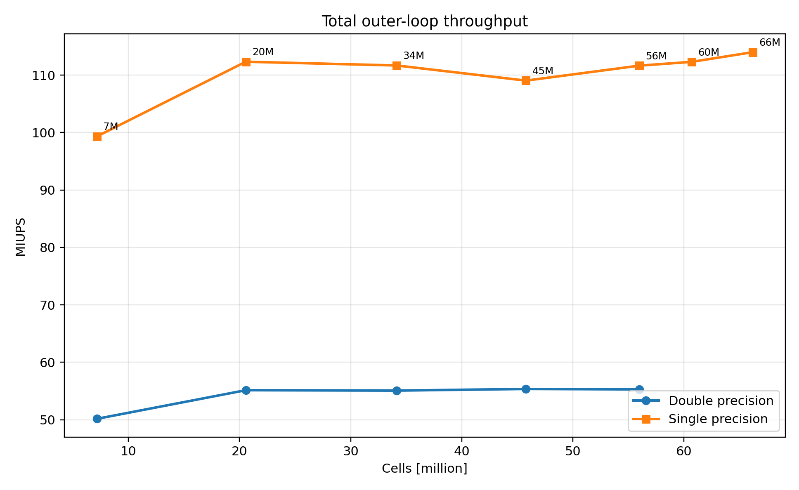
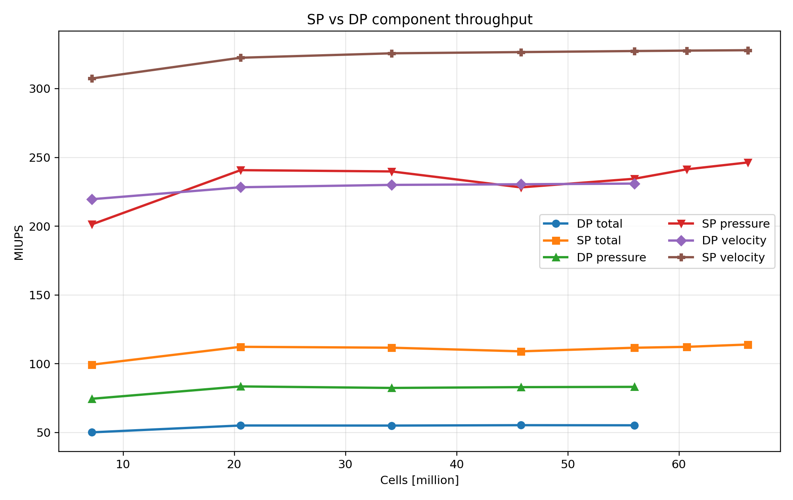
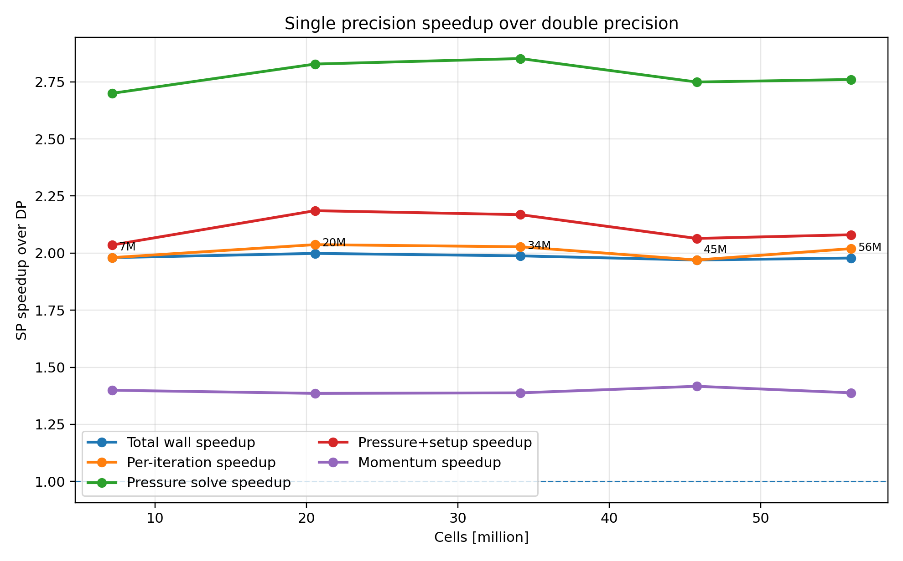
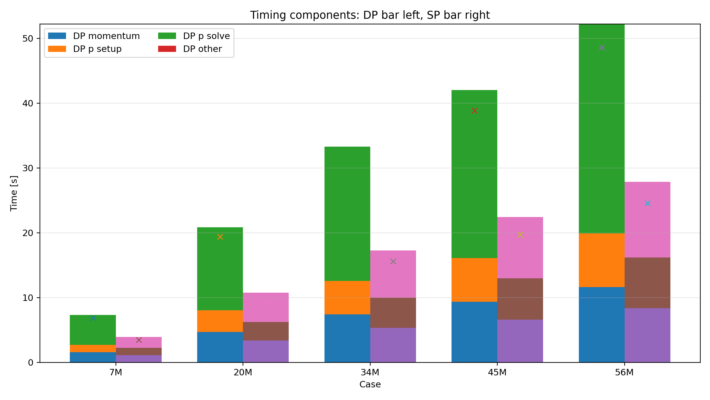

# Anabasis

Anabasis is a journey towards a modular GPU finite-volume codebase for CFD and transport problems.

The current public focus is a CUDA/HYPRE steady incompressible SIMPLE solver that reads OpenFOAM `polyMesh` meshes and runtime boundary conditions from a flat `.case` file. The code is being organized toward a modular PDE-solver layout with separate flow, Poisson, and scalar-transport options.

## Current solver

The main application is:

```text
apps/simple_gpu
```

Direct-build executable:

```text
./simple_gpu
```

The solver currently supports:

- Steady segregated SIMPLE incompressible flow.
- OpenFOAM-inspired absolute-pressure/HbyA mode:

  ```text
  pMode absolute
  pSolveMode ofAbsolute
  rcMode oflike
  pGradScheme gauss
  ```

- CUDA assembly and GPU linear solves through HYPRE/PETSc linkage.
- Runtime velocity and pressure boundary conditions from the `.case` file.
- Momentum convection choice:

  ```text
  momentumConvectionScheme central
  momentumConvectionScheme upwind
  ```

- Poisson module gradient choice:

  ```text
  poissonGradientScheme gauss
  poissonGradientScheme lsq
  ```

- Passive scalar transport module options, including:

  ```text
  scalarConvectionScheme upwind
  scalarConvectionScheme central
  ```

- Optional cylinder / patch force postprocessing, enabled only by:

  ```text
  forceEnable 1
  ```

## Repository layout

```text
apps/simple_gpu/       Main SIMPLE flow solver app
libpoisson/            Mesh, BC, gradient, HYPRE, and Poisson/elliptic utilities
libscalar/             Passive scalar transport library
cases/reference.case   Verbose documented reference case
cases/cylinder.case    Cylinder benchmark case
docs/INSTALL.md        Build notes for RTX 3060 and A100
docs/RUN_CYLINDER.md   Full cylinder run command
build_simple_gpu.sh    Direct NVCC build script
```

## Build on RTX 3060

```bash
cd ~/anabasis_v1_1

export PETSC_DIR=$HOME/src/petsc
export PETSC_ARCH=arch-linux-cuda-opt
export LD_LIBRARY_PATH="$PETSC_DIR/$PETSC_ARCH/lib:${LD_LIBRARY_PATH:-}"

SM_ARCH=sm_86 ./build_simple_gpu.sh
```

## Build on A100

```bash
cd ~/anabasis_v1_1

export PETSC_DIR=$HOME/src/petsc
export PETSC_ARCH=arch-linux-cuda-opt
export LD_LIBRARY_PATH="$PETSC_DIR/$PETSC_ARCH/lib:${LD_LIBRARY_PATH:-}"

SM_ARCH=sm_80 ./build_simple_gpu.sh
```

## Run the cylinder case

The mesh should be available at:

```text
/tmp/meshCase/constant/polyMesh
```

Run:

```bash
cd ~/anabasis_v1_1

mkdir -p runs/cylinder

mpirun -n 1 ./simple_gpu \
  -case-config cases/cylinder.case \
  -out-prefix runs/cylinder/case \
  2>&1 | tee runs/cylinder/run.log
```

Check the force output:

```bash
grep -E "Ubar, D, H|CD_vector|CL_y_vector|CL_z_vector|Wrote VTU" runs/cylinder/run.log
```

## Case files

The case format is intentionally flat key/value text. Sections such as `[mesh/output]`, `[physics/fluid]`, `[Poisson module options]`, and `[Scalar transport module options]` are comments only. They are there to make future multiphysics additions easier without changing the parser.

Use `cases/reference.case` as the documented template and `cases/cylinder.case` as the cylinder benchmark run file.

## Notes

For the OpenFOAM-like absolute-pressure path, keep:

```text
pSolveMode ofAbsolute
rcMode oflike
pGradScheme gauss
```

Avoid:

```text
pSolveMode ofAbsolute
rcMode old
```

That combination was unstable in development because the old explicit Rhie-Chow pressure term conflicts with the OpenFOAM-style absolute pressure flux path.

<!-- ANABASIS_V1_1B_BUILD_START -->

## Anabasis v1.1b: hypre 3.1 CUDA builds

v1.1b supports standalone **hypre 3.1.0 CUDA** builds with Umpire disabled and hypre internal SpGEMM forced by default. This avoids the large-mesh vendor-SpGEMM failure mode observed during BoomerAMG setup on A100-scale cases.

### Double-precision HYPRE build

Example local RTX 3060 build:

```bash
export CUDA_HOME=/usr/local/cuda-12.2
export HYPRE_ROOT=/opt/hypre-3.1.0-cuda-real
export HYPRE_LIBRARY=$HYPRE_ROOT/lib/libHYPRE.a
export SM_ARCH=sm_86
export PATH=$CUDA_HOME/bin:$PATH
export LD_LIBRARY_PATH=$CUDA_HOME/lib64:${LD_LIBRARY_PATH:-}

./build_simple_gpu_hypre31_double.sh
```

Example A100 build:

```bash
export CUDA_HOME=/usr/local/cuda-12.8
export HYPRE_ROOT=/opt/hypre-3.1.0-cuda-real
export HYPRE_LIBRARY=$HYPRE_ROOT/lib/libHYPRE.a
export SM_ARCH=sm_80
export PATH=$CUDA_HOME/bin:$PATH
export LD_LIBRARY_PATH=$CUDA_HOME/lib64:${LD_LIBRARY_PATH:-}

./build_simple_gpu_hypre31_double.sh
```

Output binary:

```text
./simple_gpu_dp
```

### Single-precision HYPRE build

The source compiles against both double- and single-HYPRE. HYPRE residual-query calls use `HYPRE_Real` temporaries so the single-HYPRE API receives the correct pointer type.

Example local RTX 3060 build:

```bash
export CUDA_HOME=/usr/local/cuda-12.2
export HYPRE_ROOT=/opt/hypre-3.1.0-cuda-single
export HYPRE_LIBRARY=$HYPRE_ROOT/lib/libHYPRE.a
export SM_ARCH=sm_86
export PATH=$CUDA_HOME/bin:$PATH
export LD_LIBRARY_PATH=$CUDA_HOME/lib64:${LD_LIBRARY_PATH:-}

./build_simple_gpu_hypre31_single.sh
```

Example A100 build:

```bash
export CUDA_HOME=/usr/local/cuda-12.8
export HYPRE_ROOT=/opt/hypre-3.1.0-cuda-single
export HYPRE_LIBRARY=$HYPRE_ROOT/lib/libHYPRE.a
export SM_ARCH=sm_80
export PATH=$CUDA_HOME/bin:$PATH
export LD_LIBRARY_PATH=$CUDA_HOME/lib64:${LD_LIBRARY_PATH:-}

./build_simple_gpu_hypre31_single.sh
```

Output binary:

```text
./simple_gpu_sp
```

For single-HYPRE runs, a practical pressure absolute tolerance is usually:

```text
pTol ≈ 1e-7
```

Use the double executable for tighter pressure solves such as `1e-10`.

### A100 SP vs DP comparison

The plots below compare v1.1b single-HYPRE and double-HYPRE A100 runs.









Memory note: `/usr/bin/time -v` reports host process RSS, not GPU VRAM. GPU VRAM should be measured separately with `nvidia-smi` or explicit in-code GPU memory logging.

<!-- ANABASIS_V1_1B_BUILD_END -->

## SIMPLE and PIMPLE GPU applications

This repository keeps the steady SIMPLE solver and transient PIMPLE solver as separate applications:

    apps/simple_gpu/      steady SIMPLE GPU solver
    apps/pimple_gpu/      transient PIMPLE GPU solver with BDF2 momentum time stepping

Reference cases are split accordingly:

    cases/simple/cylinder_re20_steady_simple.case
    cases/pimple/cylinder_3d3z_sine_re100_bdf2_800k.case
    cases/pimple/cylinder_3d3z_sine_re100_bdf2_lsq_p005.case

Build both finalized double-precision applications with:

    ./build_v1_1d_final_hypre31_double.sh

Expected executables:

    ./simple_gpu_dp
    ./pimple_gpu_bdf2_dp

The validated transient reference path is the BDF2-momentum PIMPLE solver with fixed outlet pressure:

    velocity patch_2_0 zero_gradient
    pressure patch_2_0 fixed_value 0.0
    timeScheme BDF2
    ddtCorr 0

The experimental OpenFOAM-like ddtCorr branch and open-pressure outlet/reference-cell branch are intentionally not part of this finalized baseline.
